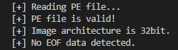

# pyPEof

[](https://github.com/runtimeterrorist/pypeof/stargazers)
[](https://github.com/runtimeterrorist/pypeof/blob/master/LICENSE)
[](https://github.com/runtimeterrorist/pypeof/network/members)
[](https://github.com/runtimeterrorist/pypeof/issues)
[](https://github.com/runtimeterrorist/pypeof/pulls)
[](https://github.com/runtimeterrorist/pypeof/commits/master)

pyPEof is a Python script for detecting suspicious EOF data on a valid PE file.

Malware often appends to EOF payloads,C2 configuration and other malicious data.

This script

- checks if the PE file is valid then checks image architecture.

- calculates the expected size of the file trough the PE Header and compares it with file size on the disk.
  (If the size on disk is not equal to the size described by the PE Header then we likely have an infected/modified file.)

- prints the EOF data and prompts user to dump it to a file.

Main goal of this "project" was learning more about the PE fileformat and common techniques used by malware authors.

Code is not perfect and improvements/suggestions are welcome.

## Installation 📦

Install necessary dependencies via pip
Install necessary dependencies.

```python
pip install -r requirements.txt
```

## Usage 📖

Run:

```
./pyPEOF.py -f pefile.exe
```

Console output:



## Contributing 🤝

Pull requests are welcome. For major changes, please open an issue first to discuss what you would like to change.

## License 📜

[MIT](https://choosealicense.com/licenses/mit/)
